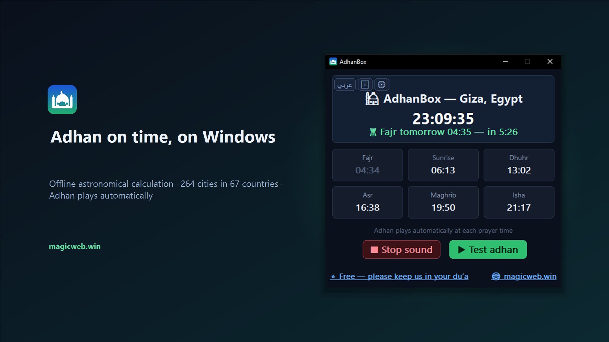
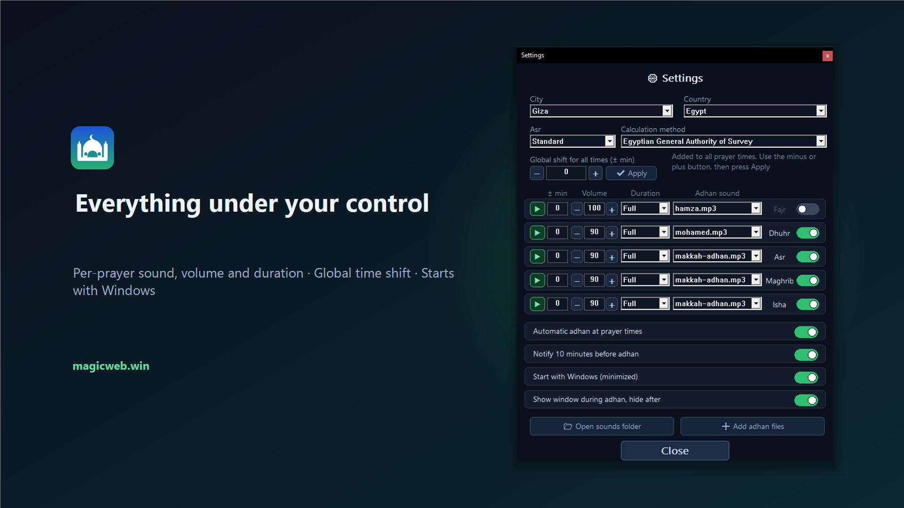
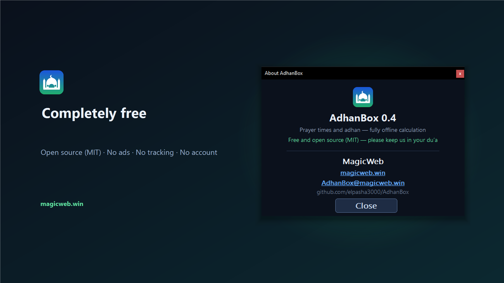
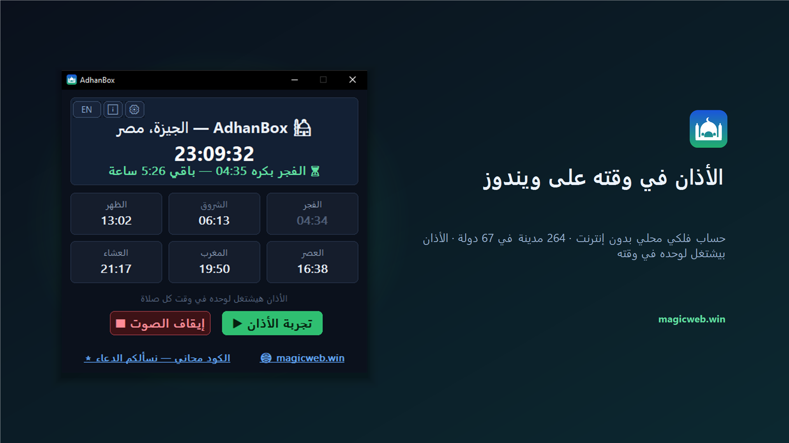
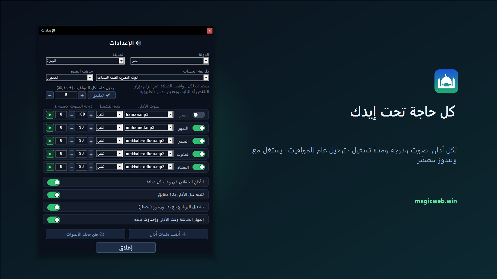

<div align="center">

# 🕌 AdhanBox for Windows

**The adhan, on time, on your PC — free, offline, open source.**

**الأذان في وقته على جهازك — مجاني، بدون إنترنت، مفتوح المصدر.**



</div>

---

## English

AdhanBox is a small native Windows application that plays the **adhan** at every prayer time and keeps today's prayer times in front of you, with a live clock and a countdown to the next prayer.

Prayer times are **calculated on your own computer** from your city's coordinates using the classical astronomical method — the app has **no network code at all** and works with no Internet connection.

### Features

- **264 cities in 67 countries** built in, **20 calculation methods** (Egypt, Umm al-Qura, MWL, ISNA, Karachi, Dubai, Kuwait, Qatar, Singapore, Tehran…), Standard or Hanafi Asr
- **Per prayer:** its own adhan sound, its own volume, its own play duration (full or N seconds), a ± minute offset, an on/off switch, and a test button
- **Global time shift** applied to all prayers at once, with an Apply button that writes the minutes into each prayer
- **Mute for 1 hour** or **for 24 hours** from the tray
- **Notification 10 minutes before** each adhan
- **Starts with Windows**, minimized to the tray
- The window **appears by itself at adhan time and hides again** when the adhan ends
- Add your own adhan **MP3** files
- **Complete Arabic and English interfaces**, with a properly mirrored right-to-left layout in Arabic
- Native C++ — no .NET, no Electron, no background service

### Screenshots

| Settings | About |
|---|---|
|  |  |

### Install

- **Microsoft Store** — coming soon (recommended: signed by Microsoft, updates automatically)
- **Build from source** — see below

### Build from source

Requires Visual Studio Build Tools (C++ desktop workload). Then:

```bat
build.bat
```

It produces a single self-contained `AdhanBox.exe` (static CRT, no runtime to install).

To re-verify the prayer-time engine against the reference Python implementation:

```bat
cd engine
build_test.bat
python verify.py
```

The engine was validated against **1,680 comparisons** (7 cities including high-latitude Oslo × 5 methods × 4 dates including both solstices × 2 Asr schools) with **identical** results.

### License

**MIT** — free for anyone to use, copy, modify and redistribute. See [LICENSE](LICENSE).

The bundled adhan recording is included for convenience; you can replace it with any audio you prefer.

### Contact

**AdhanBox@magicweb.win** · [Report an issue](../../issues)

---

## عربي

**AdhanBox** برنامج ويندوز صغير وأصلي بيشغّل **الأذان** في وقت كل صلاة، وبيخلّي مواقيت النهارده قدام عينك، ومعاها ساعة حيّة وعدّاد تنازلي للصلاة الجاية.

المواقيت **بتتحسب جوّه جهازك** من إحداثيات مدينتك بالطريقة الفلكية الكلاسيكية. البرنامج **مالوش أي كود شبكة من أصله** وشغّال من غير إنترنت خالص.

### المزايا

- **264 مدينة في 67 دولة** جاهزة، و**20 طريقة حساب** (المصرية، أم القرى، رابطة العالم الإسلامي، ISNA، كراتشي، دبي، الكويت، قطر، سنغافورة، طهران…)، ومذهب العصر: الجمهور أو الحنفي
- **لكل صلاة:** صوت أذان خاص بيها، ودرجة صوت خاصة بيها، ومدة تشغيل (كامل أو عدد ثواني)، وتقديم أو تأخير بالدقيقة، ومفتاح تشغيل وإيقاف، وزرار تجربة
- **ترحيل عام** بيتطبّق على كل المواقيت مرة واحدة، وزرار «تطبيق» بيكتب الدقايق في خانة كل صلاة
- **اكتم ساعة** أو **اكتم 24 ساعة** من أيقونة شريط المهام
- **تنبيه قبل الأذان بعشر دقايق**
- **بيشتغل مع بدء ويندوز** مصغّر في شريط المهام
- الشاشة **بتظهر لوحدها وقت الأذان وبتختفي** لما يخلص
- ضيف ملفات أذان **MP3** من عندك
- **واجهة عربية وإنجليزية كاملة**، والتخطيط بينعكس صح من اليمين للشمال في العربي
- مكتوب بـ C++‎ أصلي: من غير NET.، ومن غير Electron، ومن غير خدمات في الخلفية

### صور

| الشاشة الرئيسية | الإعدادات |
|---|---|
|  |  |

### التثبيت

- **متجر مايكروسوفت** — قريبًا (الأفضل: موقّع من مايكروسوفت وبيتحدّث لوحده)
- **البناء من الكود** — الأوامر فوق في القسم الإنجليزي

### الرخصة

**MIT** — مجاني لأي حد يستخدمه وينسخه ويعدّله ويعيد توزيعه. صوت الأذان المرفق موجود للتسهيل، وتقدر تستبدله بأي صوت تحبّه.

**الكود مجاني لوجه الله — ونسألكم الدعاء.** 🤲

### للتواصل

**AdhanBox@magicweb.win** · [بلّغ عن مشكلة](../../issues)
